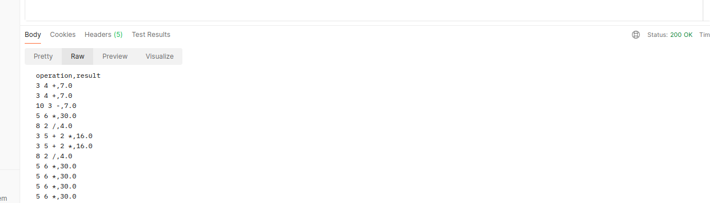
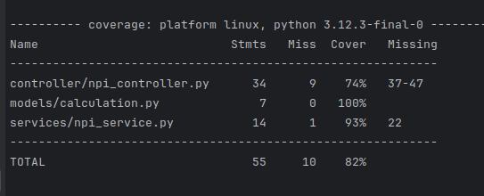

# Hicham HARRA
# RPN Calculator API

## Overview

The RPN Calculator API is a FastAPI application designed to evaluate Reverse Polish Notation (RPN) expressions. It
provides endpoints for performing arithmetic operations such as addition, subtraction, multiplication, and division,
while handling errors gracefully.

## Technologies Used

- **FastAPI**:
- **SQLite/SQLAlchemy**:
- **Uvicorn**:
- **pytest**:

## Installation with Docker

Make sure you have Docker installed and running. In the project directory, execute the following command:

```bash
 docker-compose up --build
```

## API Endpoints

### Calculate

- **POST** `/api/calculate/`
  http://localhost:8000/api/calculations/
  ex:http://localhost:8000/api/calculate/
  Evaluate an RPN expression.

  **Request Body:**

  ```json
  {
      "operation": "3 4 +"
  }
  ```

  **Responses:**

    - **200 OK**
      ```json
      {
          "operation": "3 4 +",
          "result": 7.0
      }
      ```

### Get calculations

- **GET** `/api/calculations/`
  ex: http://localhost:8000/api/calculations/
  Get All calculations
  **Responses:**

    - **200 OK**
      ```json
  [
  {"operation": "3 4 +", "result": 7.0},
  {"operation": "10 3 -", "result": 7.0}
  ]
    ```


## Downloading the CSV File

You can download the calculations CSV file from the API using the following `curl` command:

1. **Open your terminal** (Command Prompt, PowerShell, or a terminal on Linux/Mac).

2. **Navigate to your desired directory** where you want to download the CSV file.

3. **Execute the following command**:
```bash
curl -o calculations.csv http://localhost:8000/api/calculations/
```
After running the command, you will find the calculations.csv file in the directory from which you executed the command.
## Testing
  

```bash
```bash
pytest --cov=services --cov=controller --cov=models --cov-report=term-missing
```
